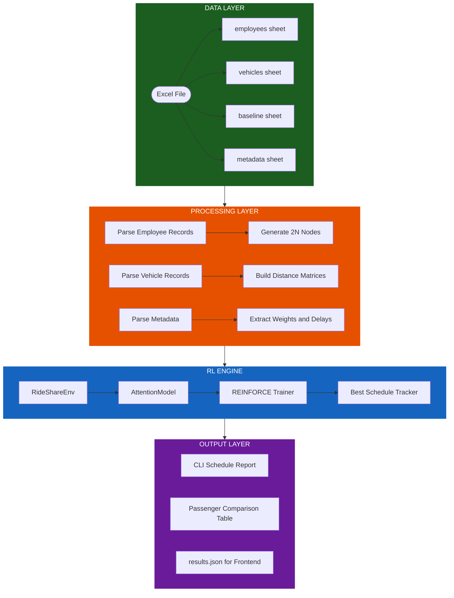
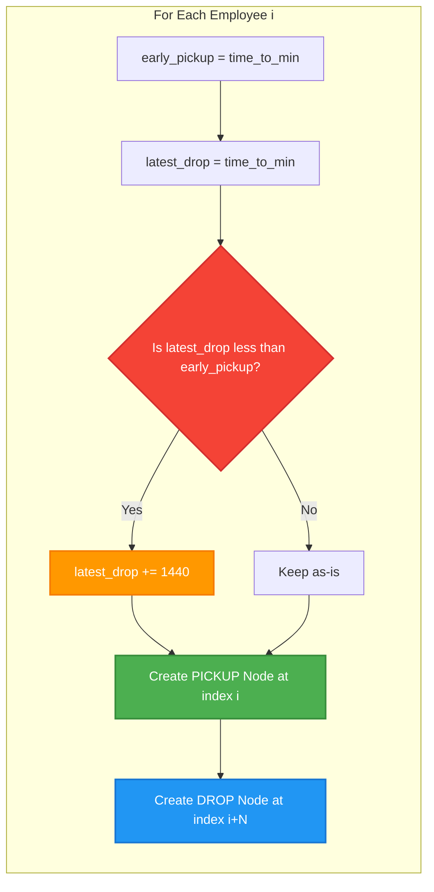
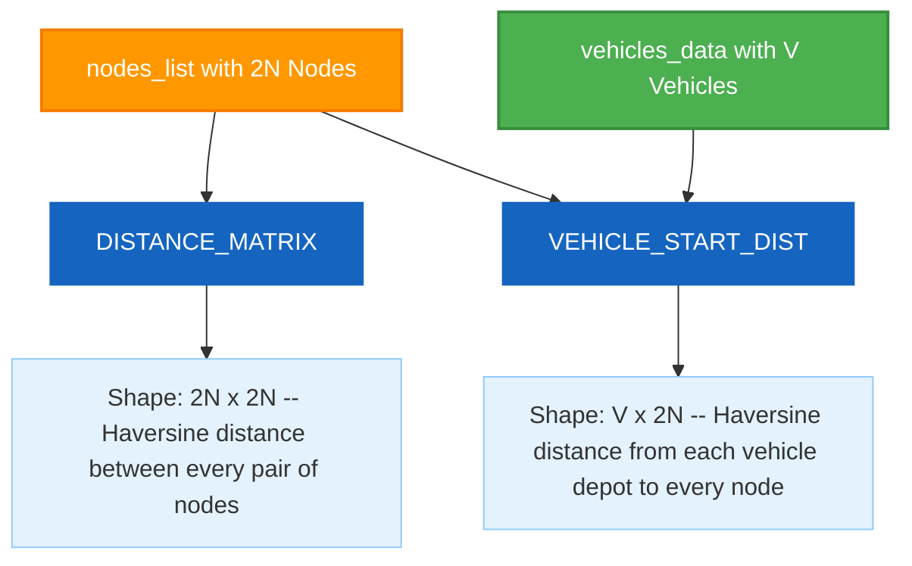
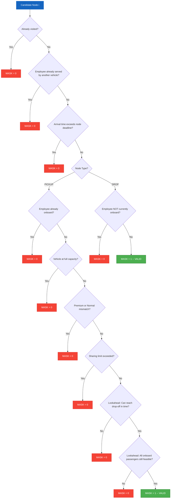
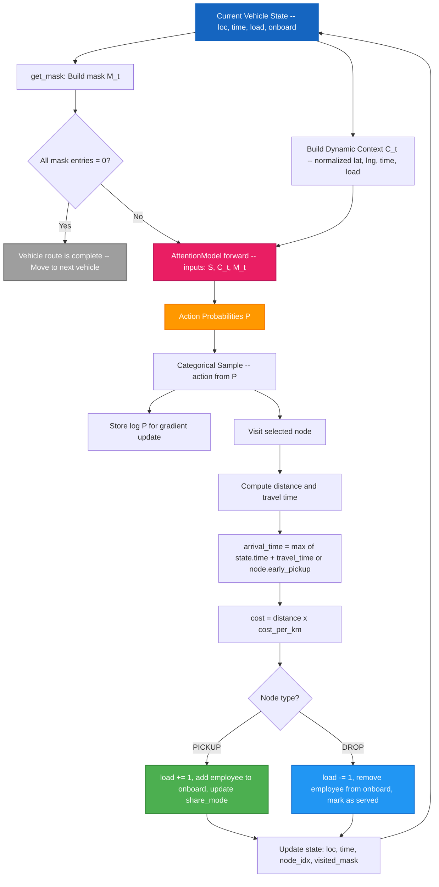
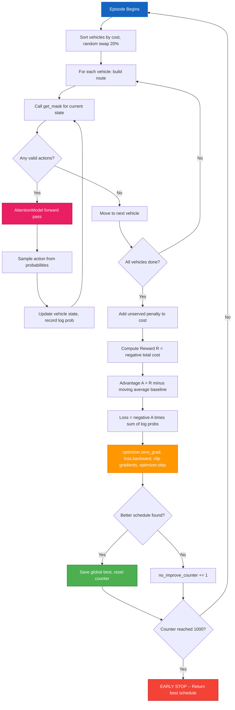
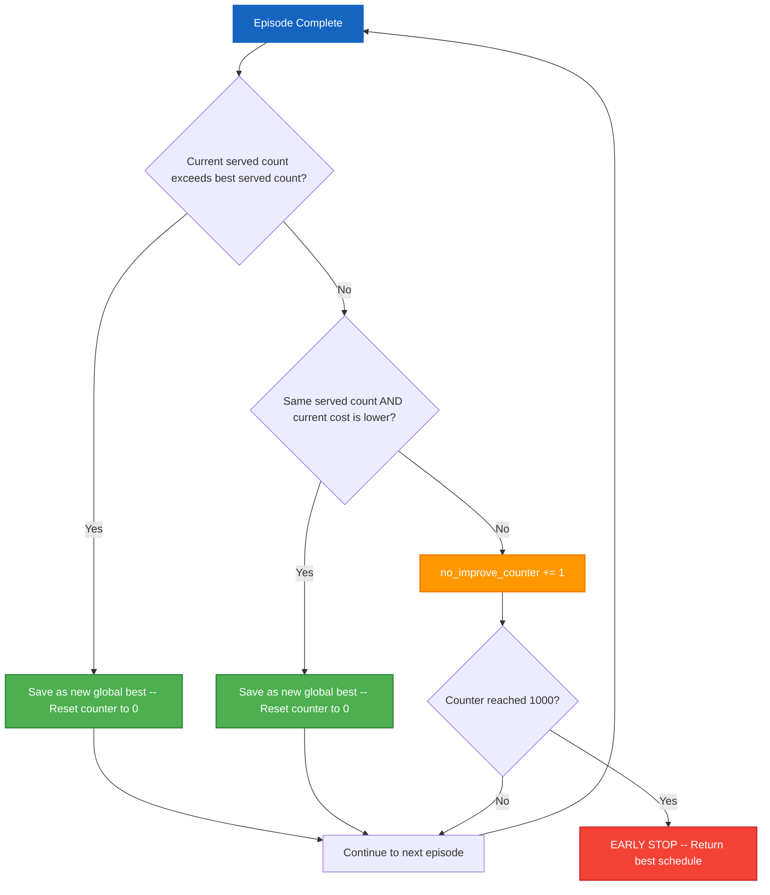

# Velora Mobitech Optimization: Corporate Commute Route Planner

An attention-based Reinforcement Learning (RL) solver designed to optimize employee commutes and fleet routing under multi-dimensional constraints (DARPTW) for **Velora Mobitech**. Implemented in `Reinforcement_Learning.py`, this optimization engine assigns employees to vehicles and generates optimal routing sequences.

### Why Reinforcement Learning?
The DARPTW is NP-Hard. Traditional solvers (like Mixed Integer Linear Programming) fail as the number of employees scales due to combinatorial explosion. Heuristics (like Nearest Neighbor) often trap vehicles in local minima. Our RL approach allows a Neural Network to dynamically learn a policy `π(θ)` that balances spatial distance, time windows, and vehicle capacity to construct near-optimal routes in real-time.

### Drawbacks & Limitations
While Reinforcement Learning is powerful for navigating complex constraints, its primary drawback in this implementation is **Execution Time**. Training the neural network over thousands of episodes requires significant computational effort, which dramatically increases system latency. Compared to simple greedy algorithms, it takes considerably longer to output the final optimized schedule.

### How to Run the Solver
1. **Download Required Files:** Ensure you have downloaded the script (`Reinforcement_Learning.py`) and your target dataset (e.g., `TestCase_TC01.xlsx`).
2. **Execute the Script:** Open your terminal and run the following command:
   ```bash
   python Reinforcement_Learning.py
   ```
3. **Input the Data Path:** When prompted with `ENTER THE DATASET Path (without quotes):`, paste the **full absolute path** to your Excel dataset file. Ensure you do not include any quotes or curly braces around the path.

---

## 1. Glossary of Terms & Core Concepts

Before delving into the mathematics and flowcharts, we strictly define the terminology used throughout the model architecture:

- **DARPTW:** Dial-A-Ride Problem with Time Windows. The objective is to design routes for a fleet of heterogeneous vehicles to service a set of passenger requests (pickups and drop-offs) while minimizing cost and respecting all constraints.
- **Node:** A physical coordinate representing a required action.
  - `N` employees generate `2N` total nodes. Node `i` is a `PICKUP`, and node `i+N` is its corresponding `DROP`.
- **Static Features `x_i`:** Properties of Node `i` that **never change**. Examples: latitude/longitude, passenger priority, earliest pickup time, and premium status.
- **Dynamic Context `c_t`:** The real-time **State** of a vehicle at step `t`. Examples: the vehicle's current location, current accumulated time, and current passenger load.
- **Action Space:** The set of all `2N` nodes. At each step, the network selects one node to visit next.
- **Masking `M_t`:** A binary array of length `2N`. If `M_t[i] = 0`, the model is strictly prohibited from visiting node `i` at step `t`. This forces the Neural Network to only explore mathematically valid routes.
- **Attention Mechanism:** A specialized Neural Network layer that dynamically calculates the "relevance" (score) of every static node `x_i` given the vehicle's current dynamic context `c_t`.
- **REINFORCE Algorithm:** A Monte Carlo Policy Gradient algorithm. It trains the neural network by sampling complete routes (episodes), calculating the total route cost, and shifting the network's weights to increase the probability of actions that resulted in lower-than-average costs.

---

## 2. System Architecture Overview

The entire system is composed of three core subsystems that interact linearly. The diagram below shows the complete end-to-end flow from raw data to the final optimized schedule:



---

## 3. Data Pre-Processing Pipeline (Detailed)

Before the Neural Network can operate, raw tabular data is transformed into pre-computed geographic matrices.

### 3.1 Data Ingestion Flow

The following diagram shows exactly what data is extracted from each Excel sheet and how it is transformed:

```mermaid
graph TD
    XL(["Excel File"]) --> EMP["employees sheet"]
    XL --> VEH["vehicles sheet"]
    XL --> BAS["baseline sheet"]
    XL --> MET["metadata sheet"]

    EMP --> E1["employee_id, priority"]
    EMP --> E2["pickup_lat, pickup_lng"]
    EMP --> E3["drop_lat, drop_lng"]
    EMP --> E4["earliest_pickup, latest_drop"]
    EMP --> E5["vehicle_preference, sharing_preference"]

    VEH --> V1["vehicle_id, fuel_type, category"]
    VEH --> V2["capacity, cost_per_km, avg_speed"]
    VEH --> V3["current_lat, current_lng, available_from"]

    BAS --> B1["baseline_cost per employee"]
    BAS --> B2["baseline_time_min per employee"]

    MET --> M1["objective_cost_weight"]
    MET --> M2["objective_time_weight"]
    MET --> M3["priority delays P1 to P5"]

    E1 --> DICT1(["employees_data list"])
    E2 --> DICT1
    E3 --> DICT1
    E4 --> DICT1
    E5 --> DICT1
    V1 --> DICT2(["vehicles_data list"])
    V2 --> DICT2
    V3 --> DICT2
    B1 --> DICT3(["baseline_cost_map dict"])
    B2 --> DICT4(["baseline_time_map dict"])
    M1 --> DICT5(["weight_cost and weight_time"])
    M2 --> DICT5
    M3 --> DICT6(["priority_delays dict"])

    style XL fill:#4CAF50,stroke:#388E3C,stroke-width:2px,color:white
    style DICT1 fill:#FF9800,stroke:#F57C00,stroke-width:2px,color:white
    style DICT2 fill:#FF9800,stroke:#F57C00,stroke-width:2px,color:white
    style DICT3 fill:#2196F3,stroke:#1976D2,stroke-width:2px,color:white
    style DICT4 fill:#2196F3,stroke:#1976D2,stroke-width:2px,color:white
    style DICT5 fill:#9C27B0,stroke:#7B1FA2,stroke-width:2px,color:white
    style DICT6 fill:#9C27B0,stroke:#7B1FA2,stroke-width:2px,color:white
```



### 3.2 Node Generation & Midnight Rollover

Time windows are converted from `HH:MM` strings to integer minutes past midnight (0 to 1440). 
If a passenger requests a pickup at `23:30` (1410 mins) and a drop-off by `00:30` (30 mins), the system detects the temporal loop and applies a **Midnight Rollover Correction**: `30 + 1440 = 1470`. This ensures that `Time_drop > Time_pickup` is always mathematically true.



**PICKUP Node fields:** `type, employee_idx, id, lat, lng, early_pickup, latest_pickup, vehicle_pref, sharing_pref, priority, abs_drop_deadline, drop_lat, drop_lng`

**DROP Node fields:** `type, employee_idx, id, lat, lng, early_pickup, latest_pickup, vehicle_pref, sharing_pref, priority`

### 3.3 Distance Matrix Pre-computation

To prevent the model from wasting CPU cycles computing geographic distances during the training loop, we pre-compute two fixed matrices:



We use the **Haversine Formula** to calculate the great-circle distance between two points on a sphere:

```
a = sin²(Δlat / 2) + cos(lat1) × cos(lat2) × sin²(Δlon / 2)
c = 2 × arcsin(√a)
d = R × c
```

Where `R = 6371 km` (Earth's radius), `lat` is latitude in radians, and `lon` is longitude in radians.

---

## 4. The RL Model: Attention Mechanism (Deep Dive)

The core brain of the DARPTW solver is the `AttentionModel`. At every step `t`, the vehicle must decide where to go next. Instead of predicting a sequence all at once, the model acts autoregressively. 

### 4.1 Tensor Inputs and Dimensionality

*Note on Normalization:* Neural Networks suffer from "exploding gradients" if inputs are vastly different in scale (e.g., passing a latitude of `26.123` alongside a time of `1440` minutes). Therefore, all inputs are strictly Min-Max normalized to the range `[0, 1]`.

**1. Static Features Matrix `S`** (Shape: `[1, 2N, 8]`)
Every node has an 8-dimensional feature vector:
1. `norm_lat` = `(lat - min_lat) / (max_lat - min_lat)`
2. `norm_lng` = `(lng - min_lng) / (max_lng - min_lng)`
3. `norm_early` = `EarlyPickup / 1440`
4. `norm_late` = `LatestDeadline / 1440`
5. `is_pickup` = `1.0` if Pickup, `0.0` if Drop
6. `norm_priority` = `Priority / 5.0`
7. `is_premium` = `1.0` if premium, `0.0` if normal
8. `share_size` = `ShareLimit / 3.0`

**2. Dynamic Context Tensor `C_t`** (Shape: `[1, 1, 4]`)
The vehicle's state at time `t`:
1. `loc_x`: Vehicle's normalized Latitude
2. `loc_y`: Vehicle's normalized Longitude
3. `time` = `CurrentTime / 1440`
4. `load` = `CurrentLoad / MaxCapacity`

### 4.2 Network Layers & Mathematical Formulation

The `AttentionModel` contains exactly **5 learnable layers** (all `nn.Linear`) with a total hidden dimension of `H = 128`:

| Layer Name | Type | Input Dim | Output Dim | Purpose |
|---|---|---|---|---|
| `embed` | nn.Linear | 8 | 128 | Embed each node's 8 static features into hidden space |
| `context_embed` | nn.Linear | 4 | 128 | Embed the 4-dim dynamic vehicle context into hidden space |
| `W_q` | nn.Linear | 128 | 128 | Project context embedding into a Query vector |
| `W_k` | nn.Linear | 128 | 128 | Project node embeddings into Key vectors |
| `V` | nn.Linear | 128 | 1 | Compress the attention alignment into a scalar score |

The Attention mechanism calculates the probability `P(action | S, C_t)` for all valid nodes:

```mermaid
graph LR
    S["Static Features -- Shape: 1 x 2N x 8"] --> E1["embed layer -- Linear 8 to 128"]
    D["Dynamic Context -- Shape: 1 x 4"] --> E2["context_embed -- Linear 4 to 128"]
    
    E1 --> K["W_k layer -- Linear 128 to 128"]
    E2 --> Q["W_q layer -- Linear 128 to 128"]

    Q --> UNSQ["unsqueeze dim=1 -- Shape: 1 x 1 x 128"]
    
    K --> ADD["Element-wise Add -- q + k"]
    UNSQ --> ADD
    
    ADD --> TH["torch.tanh -- Non-linearity"]
    TH --> VS["V layer -- Linear 128 to 1"]
    VS --> SQ["squeeze dim=-1 -- Shape: 1 x 2N"]
    
    SQ --> MASK{"masked_fill -- where mask=0 set to neg-inf"}
    MASK --> DIV["Divide by Temperature T=1.5"]
    DIV --> SM["F.softmax dim=1"]
    SM --> OUT(["Action Probabilities -- Shape: 1 x 2N"])

    style S fill:#FF9800,stroke:#F57C00,stroke-width:2px,color:white
    style D fill:#FF9800,stroke:#F57C00,stroke-width:2px,color:white
    style OUT fill:#E91E63,stroke:#C2185B,stroke-width:2px,color:white
    style MASK fill:#F44336,stroke:#D32F2F,stroke-width:2px,color:white
    style SM fill:#4CAF50,stroke:#388E3C,stroke-width:2px,color:white
```



**Step-by-Step Mathematical Operations:**

1. **Embeddings:** Project inputs into a high-dimensional space (`H = 128`).
   ```
   E_s = S × W_e       (Shape: [2N, 128])
   E_c = C_t × W_c     (Shape: [1, 128])
   ```
2. **Query and Key Generation:** The context becomes the "Query" (`q`), and the nodes become the "Keys" (`k`).
   ```
   q = E_c × W_q
   k = E_s × W_k
   ```
3. **Scoring Function (Additive Attention):** We use Bahdanau-style additive attention to score how well the Query aligns with each Key.
   ```
   u_i = V^T × tanh(q + k_i)
   ```
   Here, `u_i` is the raw unnormalized score for visiting node `i`.

4. **Masking (Constraint Enforcement):**
   ```
   If M_t[i] = 1  →  u_i stays as-is
   If M_t[i] = 0  →  u_i = -infinity (blocked)
   ```

5. **Temperature Softmax:** Convert raw scores to a probability distribution. We use a Temperature scalar `T = 1.5`. Higher temperatures flatten the distribution, forcing the model to explore more diverse routes rather than greedily picking the top score every time.
   ```
   P(a_i) = exp(u_i / T) / SUM over all j of exp(u_j / T)
   ```

---

## 5. The Rules Engine: Environment Masking

The neural network is blind to physical rules; it only outputs numbers. The `get_mask()` function serves as an impenetrable physics engine. If an action violates physical reality or hackathon constraints, its mask is set to `0`.

The following decision tree shows every single validation step the masking engine performs for each candidate node:



**Strict Constraint Checks:**
- **Visited Nodes:** Cannot visit a node twice.
- **Global Service:** Cannot pick up an employee already served by a previous vehicle.
- **Time Windows:** If arrival time exceeds the node deadline, mask = 0.
- **Capacity and Drops:** Cannot pickup if load is at capacity. Cannot drop if the employee is not currently inside the car.

**Advanced Feasibility Masking (Lookahead):**
The most complex masking logic ensures the vehicle doesn't trap itself. Before approving a `PICKUP`, the engine simulates the future:
1. It calculates the time it would take to drive to the pickup, and then drive straight to that passenger's drop-off. If this theoretical straight-line path violates the drop deadline, the pickup is blocked.
2. It iterates through all passengers *already in the car*. If driving to the new pickup node causes *any* currently onboard passenger to miss their drop-off deadline, the pickup is blocked.

---

## 6. Single Step: Action Selection & State Transition

The following diagram illustrates what happens at a single step `t` during route construction for one vehicle:



---

## 7. The REINFORCE Training Loop

The model is trained using the **REINFORCE** Policy Gradient algorithm over 100,000 episodes. 



### 7.1 Vehicle Ordering Strategy

At the start of each episode, vehicles are sorted by ascending `cost_per_km` so the cheapest vehicles are assigned routes first. This is a heuristic to naturally reduce financial cost. To prevent the model from getting stuck in a deterministic local optimum, with 20% probability two adjacent vehicles in the order are randomly swapped.

### 7.2 Objective Function (Reward formulation)

The RL agent seeks to maximize Reward `R`. Because DARPTW seeks to minimize cost, we define the reward as the negative total cost.

```
Cost_episode  = SUM over all vehicles of (Distance_v × CostPerKm_v)
Penalty       = UnservedEmployees × 10,000,000
R             = -(Cost_episode + Penalty)
```

### 7.3 Advantage and The Loss Function

To reduce gradient variance, we subtract a baseline `B` (the exponential moving average of past rewards) from `R` to calculate the **Advantage** (`A = R - B`).
If `A > 0`, the route was exceptionally good. If `A < 0`, the route was bad.

The baseline is updated after every episode using exponential smoothing:
```
B_new = 0.99 × B_old + 0.01 × R
```

The Network parameters `θ` are updated to maximize the likelihood of good routes using the Policy Gradient theorem:
```
∇J(θ) = E[ SUM over all steps t of (∇ log P(a_t | S, C_t) × A) ]
```

In PyTorch, we implement this as minimizing the negative Loss:
```
Loss = -A × SUM of log P(a_t)
```
We then apply **Gradient Clipping** (`max_norm=1.0`) to ensure extreme reward values don't permanently shatter the network weights during `loss.backward()`.

---

## 8. Convergence & Early Stopping

The algorithm uses a dual-objective tracking system to determine if the model has converged:



**Priority Hierarchy for Best Schedule Selection:**
1. **Maximizing served passengers** always takes priority over minimizing cost. A schedule serving 10 employees at higher cost will always beat a schedule serving 9 employees at lower cost.
2. **Only when served counts are equal**, the model compares financial cost and picks the cheaper schedule.

---

## 9. Output Generation

Once training halts, the best schedule is deterministically reconstructed. The script outputs:
1. A **CLI Report** showing vehicle-by-vehicle routes, per-stop timestamps, distance, cost, lateness, and drop-off durations.
2. A **Passenger Comparison Table** comparing each served passenger's actual ride duration against their baseline individual-taxi duration.
3. The **Final Analysis** comparing total baseline cost/time vs. optimized cost/time, and the weighted objective function score.
4. A **`results.json`** file containing the full structured schedule, passenger report, and evaluation metrics for the frontend mapping visualization.

---

## Contact
- **LinkedIn Profile:** [Ruchir Sharma](https://www.linkedin.com/in/ruchir-sharma-243a10337/)
